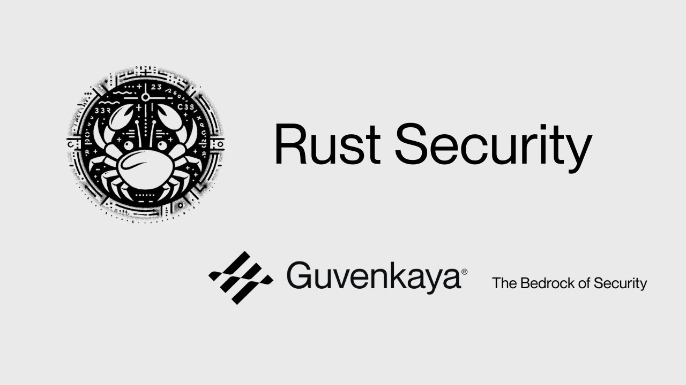

# **Rust Security - Foundations**

--------

Learn Rust Security Foundations from **Guvenkaya Security** - **https://www.guvenkaya.co/**

Learn Rust security foundations to start writing more secure software and finding Rust security issues in Rust programs. 

We will cover:

1. Error Handling
    - Recoverable Errors
    - Unrecoverable Errors
    - unwrap & expect
    - Panicking Macros

2. Arithmetic Issues
    - Integer Overflow & Underflow
    - Integer Overflow Prevention
    - Checked Maths
    - Saturating Maths
    - Casting Overflow
    - Silent Casting Overflow
    - Panicking Casting Overflow
    - Division By 0
    - Rounding Direction
    - Division Before Multiplication

3. Default Values
    - Index Out Of Bounds
    - Stack Overflow
    - OOM (Out Of Memory)
    - Crates With Vulnerabilities
    - Handy Rust Tools

--------

# [00:00](https://youtu.be/q7yjmhxyvc0?t=0)  Introduction to Rust Security Class
The introduction provides an overview of the Rust security class, highlighting the knowledge participants will gain and the focus on vulnerabilities in Rust programs for web 2 and web 3.

## Granka - A Security Research Firm
- [00:26](https://youtu.be/q7yjmhxyvc0?t=26)  Granka is a security research firm specializing in Rust security, web 3 security, and web 2 security.
- Focus on non-EVM chains and ecosystems like NEAR, Polkadot (Kusama), Substrate-based chains, Fuel, with plans to support more ecosystems.
- Timour founded Granka to address the lack of non-EVM ecosystem security resources and offer relevant content and services.

## Professional Background of Timour
- [00:56](https://youtu.be/q7yjmhxyvc0?t=56)  Timour transitioned from working at Invied Security on web two-side to focusing on non-EVM ecosystems' security.
- Led Rust security teams at Hbor Security, audited projects, created free educational content like Near Rust Mar contract security course.

# [02:21](https://youtu.be/q7yjmhxyvc0?t=141)  Table of Contents & Error Handling in Rust
The session outlines the table of contents for the class and delves into error handling concepts in Rust programming.

## Error Handling Fundamentals
- [02:50](https://youtu.be/q7yjmhxyvc0?t=170)  Two types of errors in Rust: recoverable (handled gracefully) and unrecoverable (thread panics).
- Emphasis on gracefully handling errors to avoid program crashes; introduction to Result type for recoverable errors.

## Recoverable Errors & Result Type Usage
- [04:01](https://youtu.be/q7yjmhxyvc0?t=241)  Introduces Result type with generics T (value) and E (error); demonstrates handling errors using file opening example.
- Shows code snippet using match statement for error handling; emphasizes graceful error management without program crashing.

## Propagating Errors with Question Mark Operator
- [06:18](https://youtu.be/q7yjmhxyvc0?t=378)  Discusses shorthand '?' operator as a concise way to propagate errors without explicit matching.

# [07:31](https://youtu.be/q7yjmhxyvc0?t=451)  Panic Handling in Rust
In this section, the speaker discusses how panic is handled in Rust, distinguishing between graceful shutdowns and abrupt terminations based on panic scenarios.

## Panic Handling Mechanisms
- [07:56](https://youtu.be/q7yjmhxyvc0?t=476)  Rust frameworks like Actix Web can manage panics by unwinding and catching them, allowing for controlled error handling instead of crashing the program.
- [08:22](https://youtu.be/q7yjmhxyvc0?t=502)  The choice between unwinding or aborting on panic affects the application's behavior; aborting crashes the entire process in catastrophic events like stack overflow or out-of-memory issues.
- [08:50](https://youtu.be/q7yjmhxyvc0?t=530)  Developers can specify panic behavior using `panic = "abort"` in Cargo.toml to optimize binary size but risk overlooking potential security vulnerabilities.
- [09:21](https://youtu.be/q7yjmhxyvc0?t=561)  Setting `panic = "abort"` may indicate either code optimization or inexperienced developers copying code without understanding its implications.

# [10:45](https://youtu.be/q7yjmhxyvc0?t=645)  Error Handling Strategies: Catching Panics
This segment delves into strategies for catching panics in Rust applications to prevent abrupt terminations and provide meaningful error messages to users.

## Catching Panics
- [11:09](https://youtu.be/q7yjmhxyvc0?t=669)  Utilizing `catch_unwind` allows capturing panics and continuing program execution by displaying custom error messages instead of crashing.
- [11:27](https://youtu.be/q7yjmhxyvc0?t=687)  Global hooks can be set up to handle panics at a broader level, enabling customized actions upon encountering a panic situation.
- [11:55](https://youtu.be/q7yjmhxyvc0?t=715)  Demonstrates catching a division-by-zero panic scenario using `catch_unwind` to gracefully handle errors and display informative messages.

# [12:55](https://youtu.be/q7yjmhxyvc0?t=775)  Setting Panic Hooks
The discussion shifts towards setting global panic hooks as a mechanism to customize error handling during exceptional situations within Rust applications.

## Customizing Panic Hooks
- [13:32](https://youtu.be/q7yjmhxyvc0?t=812)  Setting up global panic hooks allows developers to intercept panics and define specific actions such as displaying custom error messages before reverting to default panic behavior.

# [13:59](https://youtu.be/q7yjmhxyvc0?t=839)  Unwrap and Expect Methods
Exploring unwrap and expect methods for handling result types efficiently while ensuring robust error management within Rust programs.

## Efficient Error Handling
- [14:19](https://youtu.be/q7yjmhxyvc0?t=859)  Using `unwrap` and `expect` simplifies dealing with option types by providing concise ways to extract values or handle absence of values effectively.

# [15:12](https://youtu.be/q7yjmhxyvc0?t=912)  Error Handling and Panicking in Rust
In this section, the speaker discusses error handling and panicking in Rust, emphasizing the importance of avoiding panics by ensuring certain parts of the code won't panic.

## Error Handling Best Practices
- [15:37](https://youtu.be/q7yjmhxyvc0?t=937)  When auditing or reviewing a codebase, quickly run through all unwraps and expects to verify that they cannot panic.
- The difference between `unwrap` and `expect` lies in `expect` allowing for a custom message. Both should be used cautiously to prevent panics.

## Understanding Panicking Macros
- [16:02](https://youtu.be/q7yjmhxyvc0?t=962)  Demonstrates how using `unwrap` or `expect` can lead to panics with specific error messages.
- Emphasizes the need to avoid parts of code that could potentially cause program crashes due to panics.

# [19:22](https://youtu.be/q7yjmhxyvc0?t=1162)  Integer Overflow and Underflow in Rust
This part delves into issues related to integer overflow and underflow in Rust, highlighting their implications on program logic and the importance of handling them effectively.

## Challenges with Integer Overflow/Underflow
- [19:22](https://youtu.be/q7yjmhxyvc0?t=1162)  Integer overflow/underflow occurs when an operation results in a value larger/smaller than what a type can hold, leading to silent errors.
- Discusses different types of overflow/underflow handling mechanisms like wrapping around types.

## Risks of Silenced Errors
- [19:52](https://youtu.be/q7yjmhxyvc0?t=1192)  Silent overflow/underflow can cause significant logical errors within programs without triggering panics, especially problematic in release mode compilation.
- Provides an example demonstrating how unchecked operations can wrap around values unexpectedly.

# [22:49](https://youtu.be/q7yjmhxyvc0?t=1369)  Preventing Overflow and Underflow Issues
This segment explores methods for preventing integer overflow and underflow issues through checked arithmetic operations in Rust.

## Prevention Strategies
- [22:49](https://youtu.be/q7yjmhxyvc0?t=1369)  Introduces checked arithmetic methods like `checked_add` and `checked_sub`, which return an option type instead of causing overflows or underflows.

# [23:15](https://youtu.be/q7yjmhxyvc0?t=1395)  New Section
In this section, the speaker discusses error handling in Rust, focusing on sum values and overflow prevention techniques.

## Error Handling and Overflow Prevention
- The `sum` function returns a sum value that can be matched on. If there is an overflow or underflow, it returns `None`, prompting graceful error handling.
- Saturating math ensures that in case of overflow, the value is kept at its maximum (255 for `u8`) or minimum (0), simplifying error management.
- Understanding the implications of saturating operations is crucial to decide when to use them effectively.
- Demonstrates examples of underflow checked using subtraction and overflow saturating with addition, showcasing how values are handled based on different scenarios.
- Saturating addition ensures that regardless of the operation result, it stays within the valid range without panicking.

# [25:56](https://youtu.be/q7yjmhxyvc0?t=1556)  New Section
This segment delves into unwrapping values safely in Rust programs and provides insights on when to use unwraps appropriately.

## Unwrapping Values Safely
- Unwrapping values after checking for `None` ensures safe program execution without panicking.
- Usage of `unwrap` in scenarios where errors have been handled gracefully by checking for `None`.
- Recommendations for using `unwrap` cautiously, especially in non-production code like tests or scaffolding.

# [26:47](https://youtu.be/q7yjmhxyvc0?t=1607)  New Section
The discussion shifts towards casting overflow in Rust, exploring scenarios where casting from larger to smaller types may lead to errors.

## Casting Overflow Management
- Casting overflow occurs when converting a larger type to a smaller one with a value exceeding the smaller type's maximum capacity.
- Introducing the `as` keyword for casting but cautioning about potential silent casting overflows and logical errors.
- Differentiating between silent casting overflows and panicking casting overflows through examples involving custom types like those found in substrate crates.

# [28:39](https://youtu.be/q7yjmhxyvc0?t=1719)  New Section
Rounding methods and precision considerations are highlighted as critical aspects during calculations in Rust programs.

## Rounding Methods and Precision
- Various rounding methods such as round, ceil, and floor are available in Rust for different rounding behaviors.
- Emphasizing the importance of choosing the correct rounding direction to avoid calculation inaccuracies or bugs.

# [31:04](https://youtu.be/q7yjmhxyvc0?t=1864)  Dividing Before Multiplying
The importance of the order of operations when dealing with floating-point numbers and how it can impact the accuracy of calculations.

## Understanding Order of Operations
- Floating-point errors can occur when dividing before multiplying, leading to incorrect results.
- [31:32](https://youtu.be/q7yjmhxyvc0?t=1892)  When operating with floating-point numbers, it is better to multiply first and then divide to avoid inaccuracies.
- Converting floating-point numbers to non-floating points can result in truncation errors.
- [31:50](https://youtu.be/q7yjmhxyvc0?t=1910)  Multiplying before dividing ensures accurate results compared to dividing first.

# [32:59](https://youtu.be/q7yjmhxyvc0?t=1979)  Default Values in Rust
Exploring default values in Rust types and the implications of using `unwrap` or `default`.

## Default Values and Error Handling
- Default values are present for most types in Rust, crucial for error handling strategies.
- [33:29](https://youtu.be/q7yjmhxyvc0?t=2009)  Using `unwrap` or `default` without understanding default values can lead to logical errors.
- Different types have specific default values; e.g., unsigned integers default to zero, option types default to none.
- [33:56](https://youtu.be/q7yjmhxyvc0?t=2036)  Awareness of default values is essential, especially when working with custom types.

# [34:25](https://youtu.be/q7yjmhxyvc0?t=2065)  Impact of Incorrect Usage on Code
Discussing a real-world example where incorrect usage led to bugs in code due to improper handling of overflow prevention.

## Bug Due to Incorrect Implementation
- A case study highlighted an incorrect approach that caused bugs in code related to overflow prevention methods.
- [34:53](https://youtu.be/q7yjmhxyvc0?t=2093)  Using saturating instead of checked for overflow prevention resulted in inaccurate values and unintended consequences.

# [38:43](https://youtu.be/q7yjmhxyvc0?t=2323)  New Section
In this section, the speaker discusses custom types in Rust and the importance of handling errors gracefully.

## Custom Types and Error Handling
- [38:43](https://youtu.be/q7yjmhxyvc0?t=2323)  The speaker introduces a custom user type with default values for name (Jake) and age (34).
- [39:11](https://youtu.be/q7yjmhxyvc0?t=2351)  Demonstrates how using `unwrap_or_default` returns default values if no value is present.
- [39:38](https://youtu.be/q7yjmhxyvc0?t=2378)  Emphasizes the need to handle index out of bounds errors gracefully by using `get` method instead of causing a panic.
- [40:04](https://youtu.be/q7yjmhxyvc0?t=2404)  Explains stack overflow issues due to excessive memory consumption, often seen in recursive functions.
- [40:30](https://youtu.be/q7yjmhxyvc0?t=2430)  Discusses how stack overflow can occur not only in factorial calculations but also in functions calling each other recursively.

# [41:51](https://youtu.be/q7yjmhxyvc0?t=2511)  Memory Issues and Vulnerabilities
This section delves into memory-related problems like stack overflow and out-of-memory issues, highlighting their impact on program stability.

## Memory Problems
- [40:56](https://youtu.be/q7yjmhxyvc0?t=2456)  Illustrates a stack overflow scenario where excessive memory consumption leads to program termination.
- [41:27](https://youtu.be/q7yjmhxyvc0?t=2487)  Warns about potential crashes due to recursion or uncontrolled input leading to stack overflow or out-of-memory issues.
- [42:17](https://youtu.be/q7yjmhxyvc0?t=2537)  Demonstrates an out-of-memory issue caused by constant memory allocation until reaching the system limit.

# [42:45](https://youtu.be/q7yjmhxyvc0?t=2565)  Rust Tools for Code Analysis
This part explores tools available in Rust for code analysis, vulnerability detection, and improving code quality.

## Rust Tools
- [42:45](https://youtu.be/q7yjmhxyvc0?t=2565)  Mentions Rust's advisory database that tracks vulnerabilities in crates reported by users.
- [43:13](https://youtu.be/q7yjmhxyvc0?t=2593)  Discusses Cargo Audit for identifying vulnerabilities within dependency trees.
- [43:40](https://youtu.be/q7yjmhxyvc0?t=2620)  Highlights tools like Cargo Clippy for catching common mistakes and improving coding practices.

# [46:08](https://youtu.be/q7yjmhxyvc0?t=2768)  Memory Links and CTF Challenge
In this section, the speaker discusses memory links and introduces a Capture The Flag (CTF) challenge for testing knowledge.

## Memory Links Exploration
- Memory links are crucial for Al Grant to discover.
- The primary focus is on uncovering memory links during the discussion.

## Capture The Flag (CTF) Challenge Details
- Participants can engage in a small CTF challenge.
- To participate, individuals need to execute 'cargo run' to exploit issues across various paths.
- Successful completion warrants congratulations from the speaker.

# [47:10](https://youtu.be/q7yjmhxyvc0?t=2830)  Social Media Engagement and Feedback
This part emphasizes social media engagement and feedback opportunities for participants.

## Social Media Interaction
- Encouragement to follow the speaker on social media platforms for future content releases.
- More announcements and content will be shared through social media channels.

## Feedback Solicitation
- Participants are invited to provide feedback or suggest topics for future coverage.

# Transcript

- [00:00:00](https://www.youtube.com/watch?v=n-ym1utpzhk?t=0) ➜ hello everyone and welcome to the r security class by the end of this class you'll have all the knowledge required for you to start finding vulnerabilities
- [00:00:09](https://www.youtube.com/watch?v=n-ym1utpzhk?t=9) ➜ in Rust programs in both web 2 and web 3 and you'll have all the knowledge required for you to join our other classes or explore more advanced rust
- [00:00:21](https://www.youtube.com/watch?v=n-ym1utpzhk?t=21) ➜ security Concepts so a bit about us granka is a security research firm we specialize in Rust security
- [00:00:31](https://www.youtube.com/watch?v=n-ym1utpzhk?t=31) ➜ web 3 security and web 2 Security on web 3 security side we focus on non evm chains and non evm ecosystems and here are the ecosystems we
- [00:00:41](https://www.youtube.com/watch?v=n-ym1utpzhk?t=41) ➜ support such as near P kusama Subs based chains Fuel and soon we'll have even more ecosystems that we support a bit about me I'm timour I founded Guan
- [00:00:56](https://www.youtube.com/watch?v=n-ym1utpzhk?t=56) ➜ because I saw that non evm ecosystem in terms of security a bit left behind everyone is focusing on evm solidity and it possesses a huge risk for non evm
- [00:01:07](https://www.youtube.com/watch?v=n-ym1utpzhk?t=67) ➜ ecosystems there is there are not many security researches and lack of resources so uh I want to change this so I'm creating relevant rust security non
- [00:01:17](https://www.youtube.com/watch?v=n-ym1utpzhk?t=77) ➜ evm security content and as part of gr offering Security Services to projects in non evm ecosystems so before actually starting working at web3
- [00:01:30](https://www.youtube.com/watch?v=n-ym1utpzhk?t=90) ➜ I used to work at invied security on web two side where I was part of Designing Json web token security engine for their Flagship product which is we application
- [00:01:42](https://www.youtube.com/watch?v=n-ym1utpzhk?t=102) ➜ vulnerability scanner used by many Fortune 500 companies and at hbor security I was leading Ras security teams and was part of auditing myself or
- [00:01:51](https://www.youtube.com/watch?v=n-ym1utpzhk?t=111) ➜ leading a team um on wide variety of big uh engagements and also I created near rust Mar contract security course which is totally free on YouTube and
- [00:02:05](https://www.youtube.com/watch?v=n-ym1utpzhk?t=125) ➜ contributed by creating rust and Subs security sections to the Sans blockchain course so here are the socials don't forget to follow us I'm going to be
- [00:02:16](https://www.youtube.com/watch?v=n-ym1utpzhk?t=136) ➜ sharing many relevant non evm or R security content there so and doing some different announcements so I guess we can start
- [00:02:29](https://www.youtube.com/watch?v=n-ym1utpzhk?t=149) ➜ with table of contents we're going to start with error handling arithmetic issues and then we have some additional topics that we want to
- [00:02:37](https://www.youtube.com/watch?v=n-ym1utpzhk?t=157) ➜ cover by no means it's full list that R security has to offer there are more things but those are foundations that you should have in order to explore more
- [00:02:48](https://www.youtube.com/watch?v=n-ym1utpzhk?t=168) ➜ advanced concepts so let's start with error handling rust has two types of Errors recoverable and unrecoverable ones
- [00:02:56](https://www.youtube.com/watch?v=n-ym1utpzhk?t=176) ➜ recoverable recoverable errors are just regular errors that you can handle gracefully if something goes wrong you can display a message to a user or run
- [00:03:07](https://www.youtube.com/watch?v=n-ym1utpzhk?t=187) ➜ some logic like I don't know user entered a password Which is less than eight characters you just show show an error to user so it's like you expect
- [00:03:17](https://www.youtube.com/watch?v=n-ym1utpzhk?t=197) ➜ this error you know how to handle it you can gracefully handle this unrecoverable errors are errors that if something goes wrong you don't know how to handle it so
- [00:03:26](https://www.youtube.com/watch?v=n-ym1utpzhk?t=206) ➜ your thread just panics so and panicking behavior and rust is not the great greatest thing in the world like it might lead to a crashing program so we
- [00:03:36](https://www.youtube.com/watch?v=n-ym1utpzhk?t=216) ➜ should try to avoid it as much as possible obviously there are some caveats but in general it's advised to handle errors more gracefully whilea
- [00:03:46](https://www.youtube.com/watch?v=n-ym1utpzhk?t=226) ➜ recoverable errors and the result type so let's start with recoverable errors and before I continue you can access all the materials uh under the link in the
- [00:03:57](https://www.youtube.com/watch?v=n-ym1utpzhk?t=237) ➜ description which is going to lead you to a GitHub and also you can just check it out on uh on our post on the social media we're also going to link it there
- [00:04:06](https://www.youtube.com/watch?v=n-ym1utpzhk?t=246) ➜ so let's start with recoverable errors so rust has an amazing result type which basically just enam but generics uh T represents some value and E represents
- [00:04:18](https://www.youtube.com/watch?v=n-ym1utpzhk?t=258) ➜ an error so T is a generic type and it basically just denotes a value returned in okay variance the result is just in up with okay and error and error um
- [00:04:30](https://www.youtube.com/watch?v=n-ym1utpzhk?t=270) ➜ basically e represents an error that's returned inside of the error variant so that's how you would usually handle RAR errors and rust so you have let's say
- [00:04:41](https://www.youtube.com/watch?v=n-ym1utpzhk?t=281) ➜ method open on a file here's an example just trying to open a test. 6t and this file open returns a result type which either returns a file object or some
- [00:04:54](https://www.youtube.com/watch?v=n-ym1utpzhk?t=294) ➜ error so we just do a match on on this on this method and if everything was well we just return a file object and assign it to a variable if there was an
- [00:05:06](https://www.youtube.com/watch?v=n-ym1utpzhk?t=306) ➜ error we simply print an error and exit the process gracefully and if everything go went well we just print the metadata of a file so pretty straightforward so
- [00:05:19](https://www.youtube.com/watch?v=n-ym1utpzhk?t=319) ➜ let me go to a code and show show you how it looks if we run the program so let me actually open it here recoverable
- [00:05:30](https://www.youtube.com/watch?v=n-ym1utpzhk?t=330) ➜ errors so here you go so here we just simply have just a we're trying to open test.txt and then matching on a result type so let me let
- [00:05:43](https://www.youtube.com/watch?v=n-ym1utpzhk?t=343) ➜ me run it so let me just do this recoverable errors manual and here we go file tested TC
- [00:05:58](https://www.youtube.com/watch?v=n-ym1utpzhk?t=358) ➜ cannot be opened and we get an error which coming from this method so everything is pretty simple and we handle the error gracefully so now let's
- [00:06:08](https://www.youtube.com/watch?v=n-ym1utpzhk?t=368) ➜ go to another way how we can handle this error I mean sometimes like doing like a match explicitly can be daunting like there are many places where you have to
- [00:06:18](https://www.youtube.com/watch?v=n-ym1utpzhk?t=378) ➜ handle this so there is like a short hand which is question mark which basically does the same thing so it means just propagate an error out so if
- [00:06:29](https://www.youtube.com/watch?v=n-ym1utpzhk?t=389) ➜ let's say try Open results Returns the result type and the place where we call try open also Returns the result type we can just do question mark and we'll just
- [00:06:37](https://www.youtube.com/watch?v=n-ym1utpzhk?t=397) ➜ return an error out from here so just a nice shorthand so if I go here recoverable errors question mark exactly the same thing main returns
- [00:06:50](https://www.youtube.com/watch?v=n-ym1utpzhk?t=410) ➜ result type and file open also returns result type so we can just do a question mark in here so so let's do question
- [00:07:00](https://www.youtube.com/watch?v=n-ym1utpzhk?t=420) ➜ if I could type here we go so yeah and we just return an error here and everything and we handled the error gracefully we didn't Panic we didn't
- [00:07:10](https://www.youtube.com/watch?v=n-ym1utpzhk?t=430) ➜ crash so all good so let's continue with unrecoverable errors and before we continue forward we should mention that
- [00:07:22](https://www.youtube.com/watch?v=n-ym1utpzhk?t=442) ➜ there are two ways basically how Russ can Panic there's like unwinding and aborting like with unwinding when you panic like thread just shutdowns
- [00:07:34](https://www.youtube.com/watch?v=n-ym1utpzhk?t=454) ➜ relatively gracefully like it's not as good as we would have just handled error in recoverable errors but still like it uh reclaims resources uh it does not
- [00:07:45](https://www.youtube.com/watch?v=n-ym1utpzhk?t=465) ➜ kill the whole process destructors are called and many rust Frameworks let's say in web if I give you an example actic axom they
- [00:07:56](https://www.youtube.com/watch?v=n-ym1utpzhk?t=476) ➜ can handle those uh unwind and wiing panics while catch on wind or setting hook and taking hook and it can return like on those panics instead of crashing
- [00:08:07](https://www.youtube.com/watch?v=n-ym1utpzhk?t=487) ➜ it can return 500 internal server error it's super useful because like not every time you have an ability to determine whether something will
- [00:08:17](https://www.youtube.com/watch?v=n-ym1utpzhk?t=497) ➜ Panic or not like you like missed something or you try to access an array out of bounds or something like that so an act act or aom instead of just
- [00:08:27](https://www.youtube.com/watch?v=n-ym1utpzhk?t=507) ➜ panicking or crashing a program they will catch an unwind and return 500 internal Ser server error to a user but in case of abort the whole
- [00:08:37](https://www.youtube.com/watch?v=n-ym1utpzhk?t=517) ➜ application process is skill like it just crashes everything crashes the program and it usually occurs in like a catastrophic events when Stu
- [00:08:46](https://www.youtube.com/watch?v=n-ym1utpzhk?t=526) ➜ overflow or out of memory issues occur or if we specify Panic aboard in cargo. so we can just specify either Panic unwind or Panic abort and like P
- [00:09:02](https://www.youtube.com/watch?v=n-ym1utpzhk?t=542) ➜ if you specify Panic abort it decreases the binary size and if you as a security researcher see that certain project has a panic AB
- [00:09:12](https://www.youtube.com/watch?v=n-ym1utpzhk?t=552) ➜ board especially if you're auditing let's say uh a web2 application it's either developers handled everything and they're super
- [00:09:21](https://www.youtube.com/watch?v=n-ym1utpzhk?t=561) ➜ confident in their code and so they decid to add Panic AB board to just decrease the binary size or otherwise those are developers just Googled like
- [00:09:29](https://www.youtube.com/watch?v=n-ym1utpzhk?t=569) ➜ optimization tips for uh for rust and just copy and pasted the code in that scenario I mean you'll probably find uh many many security vulnerabilities in
- [00:09:39](https://www.youtube.com/watch?v=n-ym1utpzhk?t=579) ➜ that code so here is just an simple example um we have just main which panics and if we have we don't have a panic abort it just panics usually just
- [00:09:51](https://www.youtube.com/watch?v=n-ym1utpzhk?t=591) ➜ threat panics but if you have a panic abort like the whole application process crashes so let me show you an example so if I open panic panic yeah
- [00:10:02](https://www.youtube.com/watch?v=n-ym1utpzhk?t=602) ➜ here we go actually give me a sec yeah so let me run a panic here we go just the thread main panicked uh yeah just just regular
- [00:10:17](https://www.youtube.com/watch?v=n-ym1utpzhk?t=617) ➜ regular Panic just threat panicked but if we go now to to Cargo theel let's say here enable Panic
- [00:10:28](https://www.youtube.com/watch?v=n-ym1utpzhk?t=628) ➜ aboard and compile in release mode because we just changed the release mode so rust has two modes tbug in release mode and here as you can see we
- [00:10:39](https://www.youtube.com/watch?v=n-ym1utpzhk?t=639) ➜ just abort instead of just closing the thread it just uh closes the whole application process so let's continue and we can use
- [00:10:50](https://www.youtube.com/watch?v=n-ym1utpzhk?t=650) ➜ catch and wind uh to catch panic and as I explained before display some certain error message to a user like here we have let's say a something and we just
- [00:11:00](https://www.youtube.com/watch?v=n-ym1utpzhk?t=660) ➜ catch and wind and we Panic inside if we didn't have catch and wind we wouldn't be able to reach this part of the pr would have crashed here but here we can
- [00:11:09](https://www.youtube.com/watch?v=n-ym1utpzhk?t=669) ➜ actually assert that it's an error and then display an error message to a user as you can see we Panic here but still we reached this part where we displayed
- [00:11:17](https://www.youtube.com/watch?v=n-ym1utpzhk?t=677) ➜ an error to a user so and exactly the same thing I mean not exactly the same thing but we can set a hook which is going to be globally applied till we
- [00:11:27](https://www.youtube.com/watch?v=n-ym1utpzhk?t=687) ➜ take it out so here we set a hook which means like uh which in on the Panic it's going to basically just print custom Panic hook and here on catch and wind
- [00:11:36](https://www.youtube.com/watch?v=n-ym1utpzhk?t=696) ➜ let's say we have some panic and instead of panicking we just going to print a message and here we take it out and here we Panic uh as usual so let me show you
- [00:11:47](https://www.youtube.com/watch?v=n-ym1utpzhk?t=707) ➜ those examples uh it should be catch and went yeah exactly so I mean division by zero it's going to panic I mean if you divide
- [00:11:57](https://www.youtube.com/watch?v=n-ym1utpzhk?t=717) ➜ by zero uh what did you expect so so here we're dividing by zero we div 100 by zero so we're going to panic in here and we using catch and wind to catch it
- [00:12:08](https://www.youtube.com/watch?v=n-ym1utpzhk?t=728) ➜ and instead of basically if we didn't have this we would have panicked but now we're just going to print an error message so let me
- [00:12:17](https://www.youtube.com/watch?v=n-ym1utpzhk?t=737) ➜ actually uh run it catch on win if I could type did you mean catch and wi yes I meant that
- [00:12:30](https://www.youtube.com/watch?v=n-ym1utpzhk?t=750) ➜ uh here we go so attempt to divide by zero coming from here and we just printed Panic code and again I mean let me just uh do something like this so if
- [00:12:42](https://www.youtube.com/watch?v=n-ym1utpzhk?t=762) ➜ I do this um let me do that comment this out um I comment this out add some like I know print the print statement with some with some something
- [00:13:00](https://www.youtube.com/watch?v=n-ym1utpzhk?t=780) ➜ and now if we rerun it we won't be able to reach this part as I explained before like as you can see we just panicked an attempt divide by zero in here okay
- [00:13:12](https://www.youtube.com/watch?v=n-ym1utpzhk?t=792) ➜ awesome so let's move to setting up a hook here exactly the same thing so we going to run it set
- [00:13:23](https://www.youtube.com/watch?v=n-ym1utpzhk?t=803) ➜ hook this is a panic so basically we just first we set set up a global Panic hook which is going to display some error message so as you can see from
- [00:13:35](https://www.youtube.com/watch?v=n-ym1utpzhk?t=815) ➜ here we're trying to uh divide by zero but instead of panicking we just print this is um oh sorry we print some error from here and then at the end we take a
- [00:13:46](https://www.youtube.com/watch?v=n-ym1utpzhk?t=826) ➜ hook out and then from now on it's going to be just the regular Panic okay so let's move on to the next part it's unwrap and expect so you you
- [00:13:59](https://www.youtube.com/watch?v=n-ym1utpzhk?t=839) ➜ saw how you can gracefully handle the result types and option types I mean just give you T on option types it's also an enam which basically either it
- [00:14:09](https://www.youtube.com/watch?v=n-ym1utpzhk?t=849) ➜ basically denotes if there is a value or that there is no value I mean especially useful let's say You're Building CLI and you expect the user to enter something
- [00:14:19](https://www.youtube.com/watch?v=n-ym1utpzhk?t=859) ➜ but user can just simply not enter anything and click enter and in that scenario it's better to wrap your type with option so and so that you can
- [00:14:29](https://www.youtube.com/watch?v=n-ym1utpzhk?t=869) ➜ handle it gracefully later on to assert whether the value passed was none if it was n do something it was some do something so I mean same same concept
- [00:14:39](https://www.youtube.com/watch?v=n-ym1utpzhk?t=879) ➜ you can use match keyword to just match on some or none unwrap and expect it's like just easier Shand with some caveat so it means
- [00:14:52](https://www.youtube.com/watch?v=n-ym1utpzhk?t=892) ➜ that either if there is a value if you we are dealing with option type return a value if there is like if everything was cool
- [00:15:03](https://www.youtube.com/watch?v=n-ym1utpzhk?t=903) ➜ everything there wasn't an error and there is a value just return a value that's all that's what's what unwrap does and expect as well but if there was
- [00:15:12](https://www.youtube.com/watch?v=n-ym1utpzhk?t=912) ➜ an error or value was none Panic so when you encounter this you have to be 100% sure that this part won't panic I mean it's makes your quot
- [00:15:23](https://www.youtube.com/watch?v=n-ym1utpzhk?t=923) ➜ easier to read but I mean at the same time it's going to throw you a panic of the value was none or there was an error so when you an auditing or
- [00:15:35](https://www.youtube.com/watch?v=n-ym1utpzhk?t=935) ➜ reviewing a code base it's better to just maybe in the beginning just quickly run through all the unwraps and expects and verify that those indeed cannot
- [00:15:44](https://www.youtube.com/watch?v=n-ym1utpzhk?t=944) ➜ Panic so I mean just a just a quick tip so I mean difference between unwrap and expect is just expect with expect you can pass a custom a message apart from
- [00:15:54](https://www.youtube.com/watch?v=n-ym1utpzhk?t=954) ➜ this they they are the same so let me go to unwrap anex and just run it uh it was unwrap expect unwrap expect okay so as you can see we just
- [00:16:11](https://www.youtube.com/watch?v=n-ym1utpzhk?t=971) ➜ panicked with some message eror opening file and actual error which occurred and let me move myself here okay so let's
- [00:16:25](https://www.youtube.com/watch?v=n-ym1utpzhk?t=985) ➜ continue I mean especially if you see that the car has Panic AB Bo those will just simply crash a program so yeah just make sure that those won't
- [00:16:37](https://www.youtube.com/watch?v=n-ym1utpzhk?t=997) ➜ panic and panicking macros like you have to know them so like panic I mean yeah it means Panic so unreachable some uh in some code bases you can see unreachable
- [00:16:50](https://www.youtube.com/watch?v=n-ym1utpzhk?t=1010) ➜ micro used to denote that something is unreachable but sometimes it's actually reachable so uh you can use like a different technique like fuzzing and
- [00:16:58](https://www.youtube.com/watch?v=n-ym1utpzhk?t=1018) ➜ some times it can actually reach that part which developers thought is unreachable in that case it might actually uh crash a program or just uh
- [00:17:06](https://www.youtube.com/watch?v=n-ym1utpzhk?t=1026) ➜ throw a panic I mean to do self-explanatory assert just assertions which actually Panic debug assert same uh concept and unimplemented as well so
- [00:17:16](https://www.youtube.com/watch?v=n-ym1utpzhk?t=1036) ➜ here is an example we just get a value from a user and then we just uh depending on the value reach different parts different macros from here um
- [00:17:28](https://www.youtube.com/watch?v=n-ym1utpzhk?t=1048) ➜ pretty pretty straightforward nothing nothing too complex let me actually go to panicking panicking macros actually let me clear this
- [00:17:39](https://www.youtube.com/watch?v=n-ym1utpzhk?t=1059) ➜ part so I already written some conditions if there is no number or number is not integer we're going to be panicking on unwrap it's because we are
- [00:17:47](https://www.youtube.com/watch?v=n-ym1utpzhk?t=1067) ➜ trying to parse value as basically as i32 but the thing is is that I mean if the value is not uh if value is not a
- [00:18:00](https://www.youtube.com/watch?v=n-ym1utpzhk?t=1080) ➜ number we won't be able to parse it if you enter just something something else so so let me actually do this banic King
- [00:18:12](https://www.youtube.com/watch?v=n-ym1utpzhk?t=1092) ➜ macros let's start with this one let's say we enter a I mean as expected so we panicked on unwrap let's try again let's enter OD number so as you can see we
- [00:18:24](https://www.youtube.com/watch?v=n-ym1utpzhk?t=1104) ➜ have a condition condition here only the even numbers are accepted so we're panicking here let's enter an odd number like three only even numbers are
- [00:18:31](https://www.youtube.com/watch?v=n-ym1utpzhk?t=1111) ➜ accepted and we panicked okay so if the number is larger than 10,000 we're going to just Panic on unimplemented so I don't know let's answer something
- [00:18:42](https://www.youtube.com/watch?v=n-ym1utpzhk?t=1122) ➜ something like I don't know uh 10,000 like something big I don't know do something like this yeah here we go not implemented next one we just
- [00:18:53](https://www.youtube.com/watch?v=n-ym1utpzhk?t=1133) ➜ assert if the number equals to secret number in this case it's uh 28 let's a I don't know 30 here we go you picked a wrong number
- [00:19:03](https://www.youtube.com/watch?v=n-ym1utpzhk?t=1143) ➜ so we p on assert right so let's continue again like when you a this in code base make sure that those like if you see a sorry if you see unreachable
- [00:19:16](https://www.youtube.com/watch?v=n-ym1utpzhk?t=1156) ➜ it's actually unreachable so let's start with the big topic Artic issues there are plenty of them in uh in Rust and rust code bases
- [00:19:27](https://www.youtube.com/watch?v=n-ym1utpzhk?t=1167) ➜ so integer overflow underflow it's I mean it's pretty easy like if if the if you do certain operation and the result is larger or smaller than
- [00:19:39](https://www.youtube.com/watch?v=n-ym1utpzhk?t=1179) ➜ the maximum or minimum value that certain type can hold um it leads to an overflow or underflow like in Rust there is like silent overflow underflow or
- [00:19:52](https://www.youtube.com/watch?v=n-ym1utpzhk?t=1192) ➜ panicking one silencer it just wraps around the type which in my opinion like in general like it's worse because it does not panic but it just causes a big
- [00:20:03](https://www.youtube.com/watch?v=n-ym1utpzhk?t=1203) ➜ um big logical errors inside of your program and it's especially dangerous when you compile in release mode because in release mode when you compile just by
- [00:20:13](https://www.youtube.com/watch?v=n-ym1utpzhk?t=1213) ➜ default integer overflows are silenced and not caught during a runtime so you will have some severe logical errors so here's just an example so let
- [00:20:26](https://www.youtube.com/watch?v=n-ym1utpzhk?t=1226) ➜ me actually just run it uh integer uh overflow overflow overflow overflow uh what was it what was it what was it underflow I guess I called it
- [00:20:40](https://www.youtube.com/watch?v=n-ym1utpzhk?t=1240) ➜ underflow yeah here we go okay so okay so simple like we just sub subtract B from a and here we just read a value from a user and then we get the
- [00:20:54](https://www.youtube.com/watch?v=n-ym1utpzhk?t=1254) ➜ value and substract six so now let's to under low let's say we enter five what's going to happen we're going to panic because we compiled in debug mode
- [00:21:08](https://www.youtube.com/watch?v=n-ym1utpzhk?t=1268) ➜ so there are some runtime checks however if we go to cargo. tal let's as you can see there there is no like overflow checks yet and we compile in release
- [00:21:21](https://www.youtube.com/watch?v=n-ym1utpzhk?t=1281) ➜ mode now release mode now and we enter five again we get 255 the reason behind this is that we is that the type is u8 and
- [00:21:35](https://www.youtube.com/watch?v=n-ym1utpzhk?t=1295) ➜ the maximum value can hold is 255 so it actually wraps back since there is no like minus one wraps back and goes to maximum which is two uh 55
- [00:21:46](https://www.youtube.com/watch?v=n-ym1utpzhk?t=1306) ➜ and imagine it was a if it was a real code I mean it would have caused many severe logical errors especially if it was like uh decentralized Finance or
- [00:21:54](https://www.youtube.com/watch?v=n-ym1utpzhk?t=1314) ➜ some other application we deals with with numbers and finances so let's actually add overflow checks true and repeat the process probably it's going
- [00:22:07](https://www.youtube.com/watch?v=n-ym1utpzhk?t=1327) ➜ to recompile no actually no and as you can see we is yeah we aborted I mean usually it should panic but we have Panic abort but yeah you got the concept
- [00:22:18](https://www.youtube.com/watch?v=n-ym1utpzhk?t=1338) ➜ we just basically instead of returning actually let just just remove it instead of returning incorrect value we just we just Panic so let me actually wait a
- [00:22:31](https://www.youtube.com/watch?v=n-ym1utpzhk?t=1351) ➜ bit 1 second yeah I mean sometimes compilations can take a while but luckily our application is pretty
- [00:22:44](https://www.youtube.com/watch?v=n-ym1utpzhk?t=1364) ➜ small yeah here we go so if we five yeah I mean red main panicked so all good attempt to subtract with underflow with overflow all right so let's continue so
- [00:22:55](https://www.youtube.com/watch?v=n-ym1utpzhk?t=1375) ➜ prevention how we can actually prevent this so there I mean there are two ways like if you want to use custom methods there there is checked mat and checked
- [00:23:05](https://www.youtube.com/watch?v=n-ym1utpzhk?t=1385) ➜ mat instead of overflowing underflow it actually returns an option types option type back if every if the operation was successful no overflow or underflow it
- [00:23:15](https://www.youtube.com/watch?v=n-ym1utpzhk?t=1395) ➜ just returns a sum value and then you can gracefully match on it um if there was an error sorry not error but overflow or underflow it returns none so
- [00:23:26](https://www.youtube.com/watch?v=n-ym1utpzhk?t=1406) ➜ what you will do you will just gracefully match and see if there was an if there was an overflow just do something and return
- [00:23:35](https://www.youtube.com/watch?v=n-ym1utpzhk?t=1415) ➜ value to a user run some logic or if everything was well and you received some value just continue with your operation and you can get the list of
- [00:23:44](https://www.youtube.com/watch?v=n-ym1utpzhk?t=1424) ➜ all of them here and saturating ma saturating ma is even simpler than that like it's just going to if there was an overflow just going to keep a value at
- [00:23:54](https://www.youtube.com/watch?v=n-ym1utpzhk?t=1434) ➜ its maximum so in case of U u8 is going to keep it at 2 55 and minimum at zero so it cannot overflow but you have to keep in mind when to use which so
- [00:24:08](https://www.youtube.com/watch?v=n-ym1utpzhk?t=1448) ➜ like you have to know what's like for in saturating is doing and whether you're okay with having maximum value on overflow so in that scenario you should
- [00:24:19](https://www.youtube.com/watch?v=n-ym1utpzhk?t=1459) ➜ be aware of them and use appropriately so here is just an example uh if I go here prevention under theflow overflow
- [00:24:37](https://www.youtube.com/watch?v=n-ym1utpzhk?t=1477) ➜ prevention let me just run it first here we go so we have just underlow checked basically we're using checked mats to do subtraction and
- [00:24:47](https://www.youtube.com/watch?v=n-ym1utpzhk?t=1487) ➜ overflow saturating we use saturating addition so here we have just basically underflow checked we get an option value back so we subtract 5 minus six and we
- [00:24:58](https://www.youtube.com/watch?v=n-ym1utpzhk?t=1498) ➜ get an option and then we can just match on it to determine whether there was an overflow or not so here have overflow saturating and regardless what's going
- [00:25:07](https://www.youtube.com/watch?v=n-ym1utpzhk?t=1507) ➜ to happen it's going to return to 55 which is the maximum value of u8 so as you can see like we add 10 to 250 which is 260 but the maximum value that you8
- [00:25:18](https://www.youtube.com/watch?v=n-ym1utpzhk?t=1518) ➜ can hold is 255 so we're going to get 255 in here and here we check whether the value is none if it's none we just going to print and exit the process
- [00:25:28](https://www.youtube.com/watch?v=n-ym1utpzhk?t=1528) ➜ gracefully without any issues without panicking or without anything and here if everything was well we unwrap so that's the case about unwrapping that I
- [00:25:39](https://www.youtube.com/watch?v=n-ym1utpzhk?t=1539) ➜ mentioned before we already checked that it's none so it's safe to unwrap here so that there's no problem and also in general like you can use unwraps XS when
- [00:25:50](https://www.youtube.com/watch?v=n-ym1utpzhk?t=1550) ➜ you just scaffold in your program just uh just or in test like in test is okay or if you're just as I said like a scaffolding know program writing a PC
- [00:25:59](https://www.youtube.com/watch?v=n-ym1utpzhk?t=1559) ➜ and it's not actual production software that you that you're planning to that you're planning to deploy so so let's continue with next topic
- [00:26:11](https://www.youtube.com/watch?v=n-ym1utpzhk?t=1571) ➜ which is casting overflow casting overflow is also pretty simple it's when you try to cast a bigger type to a smaller type and the value with that
- [00:26:21](https://www.youtube.com/watch?v=n-ym1utpzhk?t=1581) ➜ bigger type holds is larger than the maximum value that uh lower the smaller type can hold so in this example as you can see we have U6 which holds 300 and
- [00:26:34](https://www.youtube.com/watch?v=n-ym1utpzhk?t=1594) ➜ we trying to cast it to u8 and since 300 is larger than maximum value of u8 which is 255 we're going to get a casting overflow and there are like several ways
- [00:26:45](https://www.youtube.com/watch?v=n-ym1utpzhk?t=1605) ➜ how you can cast and rust we can use ask keyword but in case of using ask keyword it's going to it won't panic but it's going to wrap around the type so you
- [00:26:55](https://www.youtube.com/watch?v=n-ym1utpzhk?t=1615) ➜ should always keep in mind that and double check where you use as keyword because it might lead to severe logical errors so it's a silent casting overflow
- [00:27:07](https://www.youtube.com/watch?v=n-ym1utpzhk?t=1627) ➜ and there is like panicking casting overflow like in this example there is Crate called primitive types used in substrate so there there are some custom
- [00:27:16](https://www.youtube.com/watch?v=n-ym1utpzhk?t=1636) ➜ types and they have custom methods let's say as U1 128 and in this scenario it won't actually panic but oh sorry it won't actually wrap around the type but
- [00:27:25](https://www.youtube.com/watch?v=n-ym1utpzhk?t=1645) ➜ it will Panic on over which is a lot better so let me show you uh an example and it was uh here I guess one second casting
- [00:27:42](https://www.youtube.com/watch?v=n-ym1utpzhk?t=1662) ➜ yes I mean silent let's start with silent casting again everything is available on GitHub if I could
- [00:27:54](https://www.youtube.com/watch?v=n-ym1utpzhk?t=1674) ➜ type here we go we got 44 back when we tried to cast U6 to u8 and now let's go to it's called I guess panicking casting uh yeah here we
- [00:28:08](https://www.youtube.com/watch?v=n-ym1utpzhk?t=1688) ➜ go b n King casting okay and we just uh panicked on overflow as you can see from here which is a lot
- [00:28:22](https://www.youtube.com/watch?v=n-ym1utpzhk?t=1702) ➜ better division by zero I mean if you divide by zero you're going to pic I mean it's just simple as that make sure you check denominator that's all I mean
- [00:28:32](https://www.youtube.com/watch?v=n-ym1utpzhk?t=1712) ➜ I won't be showing an example because it's pretty straightforward Runing direction we have to keep in mind uh where you're Runing your values so there
- [00:28:43](https://www.youtube.com/watch?v=n-ym1utpzhk?t=1723) ➜ was like there several uh rounding methods in Rust there's round seal and floor round just rounds to either just uh up or down to the nearest integer so
- [00:28:54](https://www.youtube.com/watch?v=n-ym1utpzhk?t=1734) ➜ if we get 1.5 it's going around to two we get 1.4 it's going to round to one seal always rounds up floor always rounds down so we have to be sure that
- [00:29:06](https://www.youtube.com/watch?v=n-ym1utpzhk?t=1746) ➜ we run to the correct direction so we won't have any logical or calculation mistakes there was uh there was a bug in Salan system I won't be going into
- [00:29:19](https://www.youtube.com/watch?v=n-ym1utpzhk?t=1759) ➜ details you can read it here but just tldr uh they were not using the correct direction so you could come up uh with certain transaction which going to yield
- [00:29:29](https://www.youtube.com/watch?v=n-ym1utpzhk?t=1769) ➜ a certain value let's say making that up let's say 1.5 which is going to actually return two and just out of thin thin air it's going to return you additional uh
- [00:29:40](https://www.youtube.com/watch?v=n-ym1utpzhk?t=1780) ➜ money so if you repeat it long enough you can actually drain some large sum so let me actually show it to you uh round round round so just a
- [00:29:53](https://www.youtube.com/watch?v=n-ym1utpzhk?t=1793) ➜ madeup example here and let's run it okay so here 1.5 using get rewards and then we're using round 1.5 rounded
- [00:30:08](https://www.youtube.com/watch?v=n-ym1utpzhk?t=1808) ➜ to two seal also to two and floor rounds to one so pretty straightforward so when you're auditing or reviewing a code base and you see those just double check
- [00:30:23](https://www.youtube.com/watch?v=n-ym1utpzhk?t=1823) ➜ that's the intended direction that the that developer wants to roundout I mean if you just um also just to uh be clear also if you
- [00:30:36](https://www.youtube.com/watch?v=n-ym1utpzhk?t=1836) ➜ just simply divide it's all it's going to floor so we're going to explain it here but also just keep that in mind so order of operations matter so when
- [00:30:48](https://www.youtube.com/watch?v=n-ym1utpzhk?t=1848) ➜ you when you divide before multiplying OB depending on the type used it can lead to Precision loss or even like totally incorrect value returned so when
- [00:30:57](https://www.youtube.com/watch?v=n-ym1utpzhk?t=1857) ➜ we operate with non floting point numbers um upon division as I explained before the value is Flor so let's say we divide before multiplying so we do at 30
- [00:31:06](https://www.youtube.com/watch?v=n-ym1utpzhk?t=1866) ➜ by 13 it actually yields something like 2.3 but since the value is Flor or truncated it's going to give you two back and then when you like multiply by
- [00:31:17](https://www.youtube.com/watch?v=n-ym1utpzhk?t=1877) ➜ those values you're going to return to 2,600 however when you first multiply and then divide we get the 3,000 back like it's a big difference it's imagine
- [00:31:32](https://www.youtube.com/watch?v=n-ym1utpzhk?t=1892) ➜ like we got like totally incorrect value in here so but when we operate with floting Point numbers we might encounter some floting point errors and depending
- [00:31:41](https://www.youtube.com/watch?v=n-ym1utpzhk?t=1901) ➜ on your error tolerance it might be devastating might be okay but still like it's better to First multiply than than divide so here if we divide first we're
- [00:31:50](https://www.youtube.com/watch?v=n-ym1utpzhk?t=1910) ➜ going to get 2,999 and something else but if we multiply first we get 3,000 back also there's another way with first uh when
- [00:32:01](https://www.youtube.com/watch?v=n-ym1utpzhk?t=1921) ➜ we operate with floting points and then we convert to non floting point here we have this but when we convert it to non floting point we remove that that part
- [00:32:11](https://www.youtube.com/watch?v=n-ym1utpzhk?t=1931) ➜ it gets truncated so we just get 2,999 however when we first multiply then divide we get 3,000 which is correct so here is just uh some example
- [00:32:22](https://www.youtube.com/watch?v=n-ym1utpzhk?t=1942) ➜ that we can run now uh it was division divide before multiply yeah here we go so let me just run run
- [00:32:33](https://www.youtube.com/watch?v=n-ym1utpzhk?t=1953) ➜ it divide before multiply here you go so as you can see
- [00:32:43](https://www.youtube.com/watch?v=n-ym1utpzhk?t=1963) ➜ here uh the one which is correct um like this one gets rewards right so first multiply then divide so we get 3,000 then the wrong one we first
- [00:32:55](https://www.youtube.com/watch?v=n-ym1utpzhk?t=1975) ➜ divide then multiply so we get two 1,600 then we do the same thing with the floting points and then at the end we start with floting point and return non
- [00:33:05](https://www.youtube.com/watch?v=n-ym1utpzhk?t=1985) ➜ floting points so as you can see values here so those are incorrect so let's continue default values uh every type in Rust um like
- [00:33:19](https://www.youtube.com/watch?v=n-ym1utpzhk?t=1999) ➜ like majority of types in Rust have default values um and we have to be aware of them sometimes uh Developers uh like if
- [00:33:29](https://www.youtube.com/watch?v=n-ym1utpzhk?t=2009) ➜ they want to silence compiler or don't want to match on a type uh if there is like an option or error they might just throw like unwrap or default if if we
- [00:33:39](https://www.youtube.com/watch?v=n-ym1utpzhk?t=2019) ➜ can unwrap it no problem it return me actual value if we cannot unwrap it just return the default value sometimes it's okay but sometimes if you are not aware
- [00:33:50](https://www.youtube.com/watch?v=n-ym1utpzhk?t=2030) ➜ what's the default value is it might introduce some logical errors so so especially if we working if you if
- [00:34:00](https://www.youtube.com/watch?v=n-ym1utpzhk?t=2040) ➜ you see a custom made type and you use unwrapper default it's super risky because you have to then go to actual type and check what the default
- [00:34:10](https://www.youtube.com/watch?v=n-ym1utpzhk?t=2050) ➜ implementation is just don't blindly trust it for instance but there are some well-known types and what's they return like for instance unsigned integers by
- [00:34:19](https://www.youtube.com/watch?v=n-ym1utpzhk?t=2059) ➜ default return zero um or or let's say an option types default value is none so you should be aware of those so here like there was a
- [00:34:32](https://www.youtube.com/watch?v=n-ym1utpzhk?t=2072) ➜ actual hack uh in aala network I won't be also going to details and also there was an actual like a hack uh breakdown I mean I might actually do
- [00:34:44](https://www.youtube.com/watch?v=n-ym1utpzhk?t=2084) ➜ that so that I can release it but just from their patch it's clearly that that two combin like two things that we already mentioned before they use
- [00:34:53](https://www.youtube.com/watch?v=n-ym1utpzhk?t=2093) ➜ incorrect way of preventing overflow so they use saturating instead of checked and apparently saturating was not the right thing so it wasn't giving them the
- [00:35:02](https://www.youtube.com/watch?v=n-ym1utpzhk?t=2102) ➜ correct value that they wanted so they were not okay with the maximum value and also they were using unwrap uh or default so they were returning a default
- [00:35:12](https://www.youtube.com/watch?v=n-ym1utpzhk?t=2112) ➜ value uh of a certain type which also turned out not to be the great choice for them so which introduced uh a bug in their code
- [00:35:23](https://www.youtube.com/watch?v=n-ym1utpzhk?t=2123) ➜ so here is just a large example uh which explored different unwrap or uh default values so let me actually run through it uh default values here we go so let
- [00:35:39](https://www.youtube.com/watch?v=n-ym1utpzhk?t=2139) ➜ me do here clear I'll remove that okay so we just have some a b CDE e and so on and we have some values assigned to them and we just print them
- [00:35:51](https://www.youtube.com/watch?v=n-ym1utpzhk?t=2151) ➜ out with unra default okay so let me just run it default uh
- [00:36:02](https://www.youtube.com/watch?v=n-ym1utpzhk?t=2162) ➜ values okay here we go so one second so let's start with the first one so here if we unwrap our default sum to since there is value just
- [00:36:14](https://www.youtube.com/watch?v=n-ym1utpzhk?t=2174) ➜ going to unwrap so it's going to return return you two and here since it's none and the type is U1 128 default value of U1 128 is zero so on unwrapper default B
- [00:36:24](https://www.youtube.com/watch?v=n-ym1utpzhk?t=2184) ➜ is going to be zero here is a pretty interesting one those two so here we have nested option type so you have sum of none what do you
- [00:36:34](https://www.youtube.com/watch?v=n-ym1utpzhk?t=2194) ➜ think is going to return it's going to actually return none and here it's also going to return none as you can see C NT however they return none for different
- [00:36:44](https://www.youtube.com/watch?v=n-ym1utpzhk?t=2204) ➜ reasons this one returns none because in case of some there is actually some value even though the value is none so on unwrap default it's
- [00:36:54](https://www.youtube.com/watch?v=n-ym1utpzhk?t=2214) ➜ actually unwrap part which returns none but here is the default part which returns none because if we just go like CN d right like if we change unwrapper
- [00:37:06](https://www.youtube.com/watch?v=n-ym1utpzhk?t=2226) ➜ default to just unwrap let's change it to just unwrap let's first change C turn up it's still going to return none
- [00:37:18](https://www.youtube.com/watch?v=n-ym1utpzhk?t=2238) ➜ because there is some value like there is some value inside of sum let we just unwrapped it even though it's not however if I change this value
- [00:37:28](https://www.youtube.com/watch?v=n-ym1utpzhk?t=2248) ➜ from unwrap to default to unwrap it's going to panic as you can see from here panicked on option on unwrap because we actually
- [00:37:39](https://www.youtube.com/watch?v=n-ym1utpzhk?t=2259) ➜ returning a non value here of the outter option type and default value of an option type is none that's why when you do unwrap or default on an option type
- [00:37:51](https://www.youtube.com/watch?v=n-ym1utpzhk?t=2271) ➜ it returns none so let me just go here let me just run it so we can see everything okay so let's go to E result type same concept since there is a value
- [00:38:04](https://www.youtube.com/watch?v=n-ym1utpzhk?t=2284) ➜ just going to unra two F since there is an error and the type is you 128 it's going to return default which is zero g is a nested result uh an option within
- [00:38:17](https://www.youtube.com/watch?v=n-ym1utpzhk?t=2297) ➜ result type so we have o of sum two so it's going to return some to here we have to unwrap twice so first unwrapping the outer part and then we have to
- [00:38:26](https://www.youtube.com/watch?v=n-ym1utpzhk?t=2306) ➜ unwrap the inner part but since we just only unwrap the outer part which is get some two back as you can see from here and here we have Oak of none again since
- [00:38:36](https://www.youtube.com/watch?v=n-ym1utpzhk?t=2316) ➜ there is none value inside we just return none again if we triy to unwrap it again then it would have cost uh a panic which just used plain unwrap so
- [00:38:46](https://www.youtube.com/watch?v=n-ym1utpzhk?t=2326) ➜ let's continue with a custom type that I was talking about so we have a custom user type as you can see in here I implemented a default trade for a user
- [00:38:56](https://www.youtube.com/watch?v=n-ym1utpzhk?t=2336) ➜ so and I put by default name Jake and age 34 so here we have option of a user so and we have some user which is j22 and we just unwrap default since there
- [00:39:08](https://www.youtube.com/watch?v=n-ym1utpzhk?t=2348) ➜ is a value which is returned a j22 and if we assign nonv value to a user and do unra or default it's going to return a default implementation which
- [00:39:18](https://www.youtube.com/watch?v=n-ym1utpzhk?t=2358) ➜ is Jake uh 34 again same concept with the result type since there is a value it's going to be j22 if there is an error it's going to be be Jake
- [00:39:29](https://www.youtube.com/watch?v=n-ym1utpzhk?t=2369) ➜ 20 34 so that's pretty much it index out of bounds pretty straightforward also if you try to access an index out of bounds you're
- [00:39:40](https://www.youtube.com/watch?v=n-ym1utpzhk?t=2380) ➜ going to get a panic so instead of this you should use dot get which is going to return an option tab which you can gracefully match against and if there is
- [00:39:50](https://www.youtube.com/watch?v=n-ym1utpzhk?t=2390) ➜ none you can handle it more gracefully I won't be showing an example for this one cuz it's pretty straightforward stack or flow so stack
- [00:39:59](https://www.youtube.com/watch?v=n-ym1utpzhk?t=2399) ➜ Overflow like this one is going to just crash your program uh close the whole application process so you should be pretty careful with this one I mean just
- [00:40:10](https://www.youtube.com/watch?v=n-ym1utpzhk?t=2410) ➜ to give you a brief like stack Overflow it's when it happens when the program consumed more memory than the call stack has available and like it's usually
- [00:40:22](https://www.youtube.com/watch?v=n-ym1utpzhk?t=2422) ➜ occurs in recursive implementations of functions because you constantly add something on a stack and also it can be
- [00:40:30](https://www.youtube.com/watch?v=n-ym1utpzhk?t=2430) ➜ not only just let's say not just factorial calculation which just recursive itself it can also happen if let's say there is a function which
- [00:40:36](https://www.youtube.com/watch?v=n-ym1utpzhk?t=2436) ➜ calls another function which which let's say function a calls function B and function B calls function a back and it just repeats uh repeats itself so in
- [00:40:46](https://www.youtube.com/watch?v=n-ym1utpzhk?t=2446) ➜ that case it's also can happen so here we have the just a vectorial calculation and we have factorial calculation with some Val you can see it's recursive So
- [00:40:56](https://www.youtube.com/watch?v=n-ym1utpzhk?t=2456) ➜ eventually it's going to lead to a stack Overflow so let me run [Music] it stack Overflow here we go as you can
- [00:41:11](https://www.youtube.com/watch?v=n-ym1utpzhk?t=2471) ➜ see this value does not cause stack Overflow since we have apparently enough memory so let's actually increase it and repeat the process now as you can
- [00:41:21](https://www.youtube.com/watch?v=n-ym1utpzhk?t=2481) ➜ see we got an abort because of the stack Overflow so in this scenario if we imagine if you imagine it was a real program this program would have
- [00:41:31](https://www.youtube.com/watch?v=n-ym1utpzhk?t=2491) ➜ crashed so when you're auditing a program you should be careful if you see recursion double check uh that there is no stack off you can just easily try and
- [00:41:43](https://www.youtube.com/watch?v=n-ym1utpzhk?t=2503) ➜ putting super large value in there or Asser that no one can uh input a super large value there whether it's actually controlled so out of memory I mean
- [00:41:54](https://www.youtube.com/watch?v=n-ym1utpzhk?t=2514) ➜ simple like if there's not enough memory to allocate for a program it's going to be all of memory issue it's going to board like if the buffer is not checked
- [00:42:03](https://www.youtube.com/watch?v=n-ym1utpzhk?t=2523) ➜ if we have Unbound data types or we just simply allocate a huge chunk of memory so it's just going to lead to out of memory
- [00:42:13](https://www.youtube.com/watch?v=n-ym1utpzhk?t=2533) ➜ issue so let me repeat this one actually let me go to out of memory o m here we go it's super simple we start with 124 and we constantly allocating uh some
- [00:42:26](https://www.youtube.com/watch?v=n-ym1utpzhk?t=2546) ➜ memory and on each iteration we just double the size as you can see we first like started with with 1024 and then we're
- [00:42:41](https://www.youtube.com/watch?v=n-ym1utpzhk?t=2561) ➜ doubling doubling doubling eventually we reached uh the part where we cannot allocate more and we aborted so this one would have crashed a
- [00:42:50](https://www.youtube.com/watch?v=n-ym1utpzhk?t=2570) ➜ program okay so let's continue with crates with non vulnerability so there is Rusted wiary database where uh if you discover some issue with a crate uh you
- [00:43:00](https://www.youtube.com/watch?v=n-ym1utpzhk?t=2580) ➜ can um it will if you report it and gets fixed it will eventually end up in Rust advisory database where you where if you use cargo audit it will Traverse your
- [00:43:13](https://www.youtube.com/watch?v=n-ym1utpzhk?t=2593) ➜ dependency tree and display some vulnerabilities in your crates I mean simple as that um obviously like not everything is there is actually
- [00:43:22](https://www.youtube.com/watch?v=n-ym1utpzhk?t=2602) ➜ exploitable in your own program like it may be like can be super deep in the dependency tree and you cannot just simply fix it or upgrade it without
- [00:43:33](https://www.youtube.com/watch?v=n-ym1utpzhk?t=2613) ➜ breaking your outter dependencies so you have to double check and see if you can upgrade it upgrade if you cannot just make sure that it's not exploitable uh
- [00:43:42](https://www.youtube.com/watch?v=n-ym1utpzhk?t=2622) ➜ in your scenario so here are some handy tools like we won't be talking about them in this uh in this class some of them are
- [00:43:51](https://www.youtube.com/watch?v=n-ym1utpzhk?t=2631) ➜ more uh more advanced and some of them are mostly for unsafe rust so um in advanced class we're going to cover some unsafe rust vulnerabilities but in this
- [00:44:02](https://www.youtube.com/watch?v=n-ym1utpzhk?t=2642) ➜ one we focus solely on the safe rust to cover the foundation so cargo already talked about this this discover vulnerabilities in crate cargo clippy
- [00:44:11](https://www.youtube.com/watch?v=n-ym1utpzhk?t=2651) ➜ it's amazing linta it's going to catch common mistakes or bad practices in your code I learned a ton of rust and good practices from just simply using cargo
- [00:44:20](https://www.youtube.com/watch?v=n-ym1utpzhk?t=2660) ➜ clipp and you will be surprised that not everyone is using cargo clippy so yeah uh mirri so it's a just rust mirror inter interpreter to
- [00:44:29](https://www.youtube.com/watch?v=n-ym1utpzhk?t=2669) ➜ discover basically wide variety of memory issues it's more useful if you deal with unsafe rust cargo GAA um it just discovers unsafe rust within your
- [00:44:38](https://www.youtube.com/watch?v=n-ym1utpzhk?t=2678) ➜ code within crates so it's sometimes useful to just run through it I mean if you let's say I can imagine the use case of it is that if you're using if you
- [00:44:50](https://www.youtube.com/watch?v=n-ym1utpzhk?t=2690) ➜ want to discover um let's say unsave code inside of different crates so that you can go in there and try to find bugs in them so that can be useful so cargo
- [00:45:01](https://www.youtube.com/watch?v=n-ym1utpzhk?t=2701) ➜ torine just to measure test coverage rust analy just like if you're working with rust most probably already have it but just in case someone is new rust
- [00:45:10](https://www.youtube.com/watch?v=n-ym1utpzhk?t=2710) ➜ analyzer just install it it's amazing LSP and ID code extension like code completion code checking and everything cargo expand expands rust
- [00:45:19](https://www.youtube.com/watch?v=n-ym1utpzhk?t=2719) ➜ macros uh super useful if the the code that you're reviewing has customade macros it's not always that easy to understand what's
- [00:45:33](https://www.youtube.com/watch?v=n-ym1utpzhk?t=2733) ➜ what's is being written because macro like regular rust and macro rust is super different like it's not the same thing you're not exactly writing the
- [00:45:43](https://www.youtube.com/watch?v=n-ym1utpzhk?t=2743) ➜ same rust code there so it's super hard to read sometimes so what you could do there is like imagine there is a proc macro what you do you run cargo expand
- [00:45:52](https://www.youtube.com/watch?v=n-ym1utpzhk?t=2752) ➜ and you see expanded the sugared version of this what's actually being pasted inside of your code and then you can deduce what's it's
- [00:46:01](https://www.youtube.com/watch?v=n-ym1utpzhk?t=2761) ➜ actually doing and you might be able to find some mistakes there so that's the power of cargo expand cargo F from fs fers and cargo Al Grant is just to
- [00:46:11](https://www.youtube.com/watch?v=n-ym1utpzhk?t=2771) ➜ discover memory links so if we I mean that's that's all like when it comes to the the topics that I wanted to cover today however like we also have a
- [00:46:25](https://www.youtube.com/watch?v=n-ym1utpzhk?t=2785) ➜ small CTF so that you can test your knowledge so here's the small CTF we have uh just several like several things in here you
- [00:46:39](https://www.youtube.com/watch?v=n-ym1utpzhk?t=2799) ➜ just can do uh cargo run and just run the code and then try to exploit issues in every single path uh that's pretty much it and if you exploit everything
- [00:46:53](https://www.youtube.com/watch?v=n-ym1utpzhk?t=2813) ➜ just um DM me and I'll congratulate you and and I can short and I'll also short list you to so that you can get a notification when we release more
- [00:47:04](https://www.youtube.com/watch?v=n-ym1utpzhk?t=2824) ➜ advanced courses so yeah that's pretty much it again let me go back to to our socials again here are our socials
- [00:47:16](https://www.youtube.com/watch?v=n-ym1utpzhk?t=2836) ➜ please follow us I'll be releasing more content we'll going to be making more announcements and yeah thank you for thank you for taking this class and let
- [00:47:27](https://www.youtube.com/watch?v=n-ym1utpzhk?t=2847) ➜ me know if you have any feedback or anything that you think would be valuable for us to cover in more advanced rust thank you

---

📺 [**Watch the full video**](https://youtu.be/q7yjmhxyvc0)

🔗 [**Generated with Video Highlight**](https://videohighlight.com/)

Materials from the class: [**GitHub - Guvenkaya/rust-security-workshop: Beginner Friendly Rust Security Workshop**](https://github.com/Guvenkaya/rust-security-workshop)

